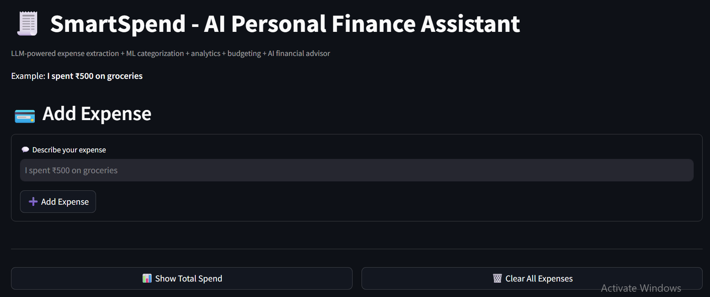
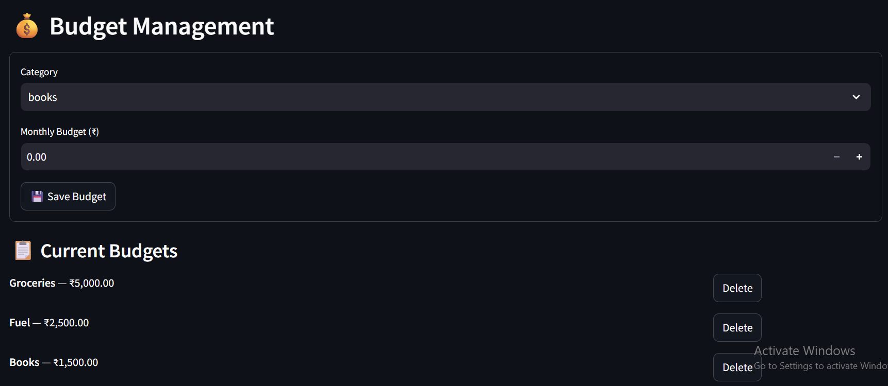
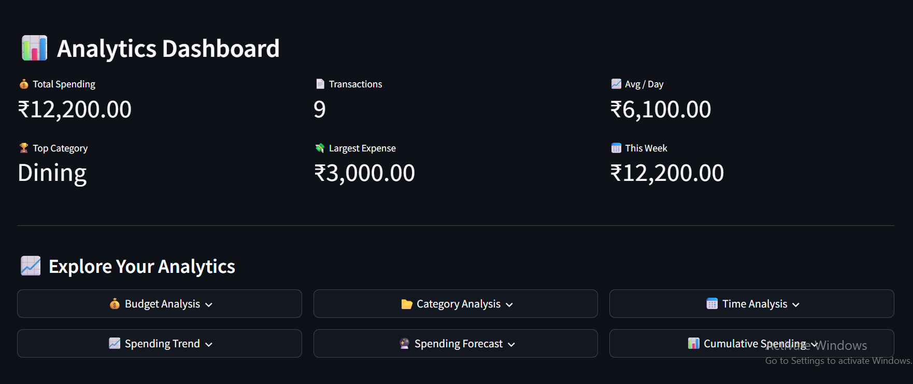
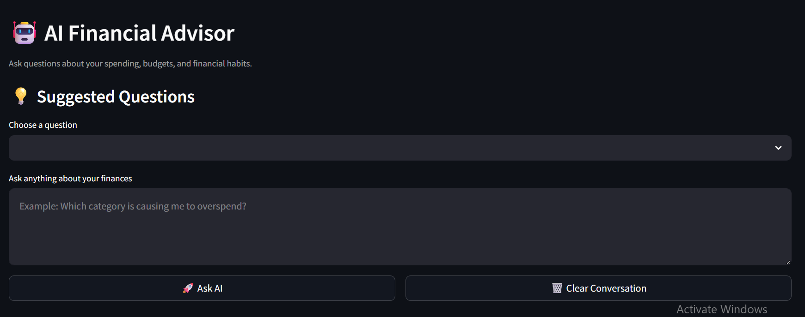

# 💸 SmartSpend AI

> An AI-powered personal finance assistant combining LLMs, machine learning, data analytics, budgeting, conversational AI, and spending forecasting.

SmartSpend AI lets users record expenses using natural language, automatically categorize transactions, analyze spending patterns, create and manage budgets, receive AI-powered financial insights, and interact with a conversational financial advisor.

**Live Demo:** Add your Streamlit app URL here

---

## 📸 Application Preview

### 🏠 Main Dashboard



### 💰 Budget Management



### 📊 Analytics Dashboard



### 🤖 AI Financial Advisor



---

## 🚀 Why SmartSpend?

SmartSpend is designed as more than a CRUD-based expense tracker. It combines deterministic financial logic, LLM capabilities, and machine learning into one end-to-end application.

### Key highlights

- 🤖 Natural-language expense extraction using Groq
- 🧠 Hybrid expense categorization using LLM + TF-IDF/Logistic Regression
- 📊 Interactive financial analytics
- 💰 Custom category budgets with budget tracking
- 🔎 Proactive AI-generated financial insights
- ❤️ Application-specific Financial Health Score
- 💬 Conversational AI Financial Advisor with session-based conversation memory
- 📈 Machine-learning spending forecasting
- ⚠️ Forecast vs. budget analysis
- 🛡️ Validation, confidence checks, fallback parsing, and insufficient-data safeguards
- 🗄️ SQLite-backed expense and budget storage

---

## 🏗️ Architecture

```text
                         ┌──────────────────────┐
                         │        User          │
                         └──────────┬───────────┘
                                    │
                                    ▼
                         Natural Language Input
                                    │
                                    ▼
                    ┌───────────────────────────┐
                    │       Groq LLM            │
                    │   Expense Extraction      │
                    └─────────────┬─────────────┘
                                  │
                                  ▼
                    ┌───────────────────────────┐
                    │   Pydantic Validation     │
                    └─────────────┬─────────────┘
                                  │
                                  ▼
                         SQLite Data Storage
                                  │
                    ┌─────────────┴─────────────┐
                    │                           │
                    ▼                           ▼
            Analytics Engine              ML Classifier
                    │                           │
                    ▼                           ▼
             Budget Engine              Category Prediction
                    │                           │
                    └─────────────┬─────────────┘
                                  │
                                  ▼
                         Financial Analytics
                                  │
             ┌────────────────────┼────────────────────┐
             │                    │                    │
             ▼                    ▼                    ▼
        Dashboard          AI Financial Advisor   Forecasting
                                  │                    │
                                  ▼                    ▼
                                Groq                ML Model
                                  │                    │
                                  └─────────┬──────────┘
                                            │
                                            ▼
                                   User-facing Insights
```

---

## ✨ Features

### 1. Natural-Language Expense Entry

Users can enter expenses naturally:

> *"I spent ₹500 on coffee"*

The application extracts structured information such as:

- **Amount:** ₹500
- **Category:** Dining
- **Note:** Coffee purchase
- **Date:** Current date

If the Groq API is unavailable, the application can fall back to regex-based parsing.

---

### 2. Hybrid ML Expense Categorization

SmartSpend uses a hybrid categorization approach.

```text
Expense Note
     │
     ├──────────────► LLM / Regex Category
     │
     ▼
TF-IDF + Logistic Regression
     │
     ▼
Confidence + Similarity Checks
     │
     ▼
Personalized Category Prediction
```

The ML classifier learns from historical expense notes stored in SQLite.

It uses:

- **TF-IDF** for text representation
- **Logistic Regression** for classification
- **Confidence thresholding**
- **TF-IDF cosine-similarity guard**

The similarity guard helps prevent the classifier from confidently categorizing notes that are unlike the examples it was trained on.

---

### 3. Financial Analytics

The analytics engine provides:

- **Key metrics:** Total spending, transaction count, average daily spending, highest spending category, and largest transaction
- **Breakdowns:** Daily, monthly, weekday, and cumulative spending patterns
- **Category-level spending summaries**
- Interactive visualizations through Streamlit

---

### 4. Budget Management

Users can create custom budgets for existing or new categories.

Example:

| Category | Budget |
| :--- | ---: |
| **Groceries** | ₹5,000 |
| **Fuel** | ₹2,500 |
| **Books** | ₹1,500 |
| **Entertainment** | ₹3,000 |

SmartSpend tracks:

- Budget usage percentage
- Amount spent
- Remaining budget
- Budget status
- Overspending

Budgets are stored in SQLite and can be updated or deleted.

---

### 5. AI Financial Advisor

Users can ask natural-language questions such as:

- *"How much did I spend this month?"*
- *"Which category should I reduce?"*
- *"Am I overspending?"*
- *"How can I save more money?"*

The advisor combines application-generated financial data with Groq to provide contextual natural-language responses.

---

### 6. Conversational Memory

The financial advisor supports contextual follow-up questions during a session.

Example:

> **User:** Which category had the highest spending?  
> **AI:** Dining.  
> **User:** How can I reduce that?  
> **AI:** Dining is your highest spending category...

Conversation history is maintained using Streamlit session state.

---

### 7. Proactive Financial Insights

SmartSpend identifies useful financial patterns such as:

- Categories exceeding or approaching budget limits
- Highest spending categories
- Large transactions
- Active spending categories without configured budgets

The core financial calculations are performed deterministically in Python. The LLM is used for natural-language interpretation and explanation rather than performing the underlying financial calculations.

---

### 8. Financial Health Score

SmartSpend calculates an application-specific **0–100 Financial Health Score** using factors such as:

- **Budget Adherence**
- **Budget Coverage**
- **Spending Concentration**

The score includes a natural-language explanation and confidence indicator.

> **Disclaimer:** The Financial Health Score is an educational/project-specific metric and does not constitute professional financial advice.

---

### 9. Spending Forecasting

SmartSpend includes an end-to-end machine-learning forecasting pipeline:

```text
Historical Expenses
        ↓
Daily Aggregation
        ↓
Feature Engineering
        ↓
Baseline Model
        ↓
Improved Model
        ↓
Time-Aware Validation
        ↓
Model Comparison
        ↓
Recursive Forecasting
        ↓
Month-End Projection
```

Features include:

- Day of week
- Weekend indicator
- Day of month
- Month
- Previous-day spending
- Previous-week spending
- 7-day rolling average

The system also checks whether enough historical data exists before producing a forecast, reducing the risk of misleading projections.

---

## 🧠 Machine Learning Approach

### Expense Categorization

```text
Expense Note
     ↓
TF-IDF
     ↓
Logistic Regression
     ↓
Confidence Check
     ↓
Similarity Guard
     ↓
Category Prediction
```

The classifier is trained using the user's historical expense notes and categories stored in SQLite.

### Spending Forecasting

The forecasting pipeline compares a baseline Linear Regression model with an improved model using temporal and lag-based features.

Validation uses **TimeSeriesSplit** rather than random shuffling so that future information is not mixed into training data.

Evaluation metrics include:

- **MAE**
- **RMSE**
- **R²**

---

## 🛡️ Reliability & Safety

SmartSpend follows a **deterministic-first design**:

> Core financial calculations are handled by Python; the LLM is primarily used for structured extraction, explanation, and conversational interaction.

Key safeguards include:

- **Pydantic validation** for structured LLM outputs
- **Regex fallback** when LLM parsing fails
- **ML confidence thresholds**
- **TF-IDF similarity checks**
- **Insufficient-data checks** for forecasting
- **Empty-data handling**
- **Budget validation**
- **API error handling**
- **SQLite-backed data operations**

---

## 🛠️ Tech Stack

| Domain | Technologies |
| :--- | :--- |
| **Language** | Python |
| **Frontend** | Streamlit |
| **Data Science** | Pandas, NumPy, Matplotlib |
| **Machine Learning** | Scikit-learn, TF-IDF, Logistic Regression, Linear Regression, TimeSeriesSplit |
| **Generative AI** | Groq API, Pydantic, Prompt Engineering |
| **Storage** | SQLite |
| **Environment Management** | python-dotenv |
| **Deployment** | Streamlit Community Cloud |
| **Testing** | Python-based forecasting tests |

---

## 📁 Project Structure

```text
SmartSpend-AI/
│
├── app.py
├── advisor.py
├── analytics.py
├── budget.py
├── classifier.py
├── database.py
├── forecasting.py
├── llm_parser.py
├── utils.py
│
├── test_forecast.py
│
├── requirements.txt
├── .gitignore
├── .env.example
├── README.md
│
└── screenshots/
    ├── dashboard.png
    ├── budget.png
    ├── analytics.png
    └── ai-advisor.png
```

> File names should match the files currently present in the repository. If your forecasting module is named `forecast.py` instead of `forecasting.py`, use the actual filename in this section.

---

## ⚙️ Installation

### 1. Clone the repository

```bash
git clone https://github.com/YOUR_USERNAME/SmartSpend-AI.git
cd SmartSpend-AI
```

### 2. Create a virtual environment

```bash
python -m venv venv
```

Activate it depending on your operating system.

**Windows:**

```cmd
venv\Scriptsctivate
```

**macOS / Linux:**

```bash
source venv/bin/activate
```

### 3. Install dependencies

```bash
pip install -r requirements.txt
```

### 4. Configure the Groq API key

Create a `.env` file in the project root:

```env
GROQ_API_KEY=your_groq_api_key_here
```

> **Security:** Never commit your `.env` file or API key to GitHub.

---

## ▶️ Running the Application

Start Streamlit:

```bash
streamlit run app.py
```

The application will open in your browser.

---

## 🧪 Testing

Forecasting components can be tested independently:

```bash
python test_forecast.py
```

The project also includes safeguards for insufficient historical data.

---

## 📊 Example Workflow

```text
"I spent ₹800 on groceries"
             ↓
      Groq extraction
             ↓
     Pydantic validation
             ↓
     Hybrid categorization
             ↓
       Save to SQLite
             ↓
      Analytics engine
             ↓
   Budget + Dashboard
             ↓
  AI Financial Advisor
```

---

## ☁️ Deployment

SmartSpend is deployed using **Streamlit Community Cloud**.

For deployment:

1. Push the project files to GitHub.
2. Connect the GitHub repository to Streamlit Community Cloud.
3. Set `app.py` as the application entry point.
4. Add the Groq API key through Streamlit Secrets.

Example secret:

```toml
GROQ_API_KEY = "your_groq_api_key_here"
```

### Data storage note

The application uses SQLite for its database layer. The local database file is intentionally excluded from source control.

For a portfolio/demo deployment, this keeps personal expense data out of GitHub. SQLite on a hosted app should not be treated as a production-grade persistent multi-user database; a future production version could use a managed PostgreSQL database.

---

## 🔐 Environment Variables

### Local development

Create:

```env
GROQ_API_KEY=your_groq_api_key_here
```

### Streamlit deployment

Configure the same variable through Streamlit Secrets rather than committing credentials to the repository.

The actual `.env` and secrets files are intentionally excluded from source control.

---

## ⚠️ Current Limitations

- **Forecasting:** Predictions require sufficient historical data.
- **Financial Health Score:** The score is a project-specific heuristic, not a professional financial assessment.
- **Cold Start:** ML categorization and forecasting improve as more historical data becomes available.
- **Hosted SQLite:** SQLite is suitable for this portfolio/demo application but is not intended here as a production multi-user database.
- **LLM Dependency:** Some natural-language features depend on Groq availability, although expense parsing has a regex fallback.
- **Financial Advice:** The application is educational and should not be treated as professional financial advice.

---

## 🔮 Future Improvements

Potential extensions include:

- 🔍 Anomaly detection for unusual transactions
- 📄 Automated monthly/PDF financial reports
- 📈 Category-level spending forecasts
- 🏦 Bank statement/transaction import
- 🔐 User authentication
- 🗄️ PostgreSQL for production-grade persistent storage
- 🐳 Docker support
- 🧪 Expanded automated test coverage
- ⚙️ CI/CD pipeline
- 📊 More advanced time-series forecasting models

---

## 👨‍💻 Author

**Harshay Chouhan**  
Data Science & AI Student

---

## 📄 License

This project is intended as a portfolio and educational project.
